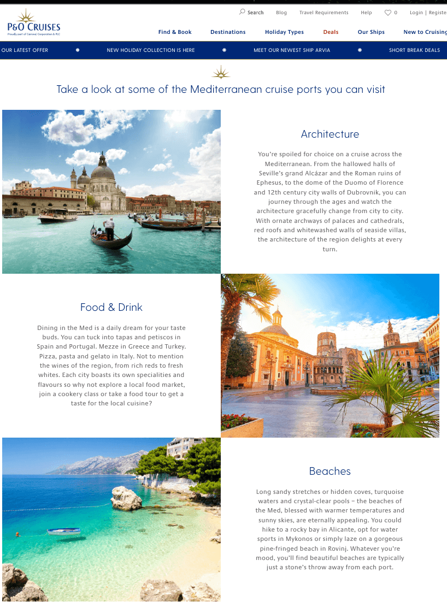
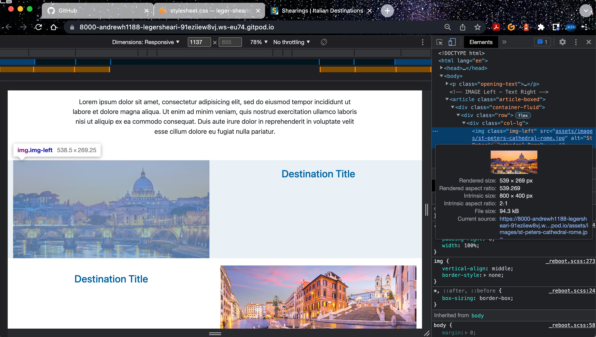
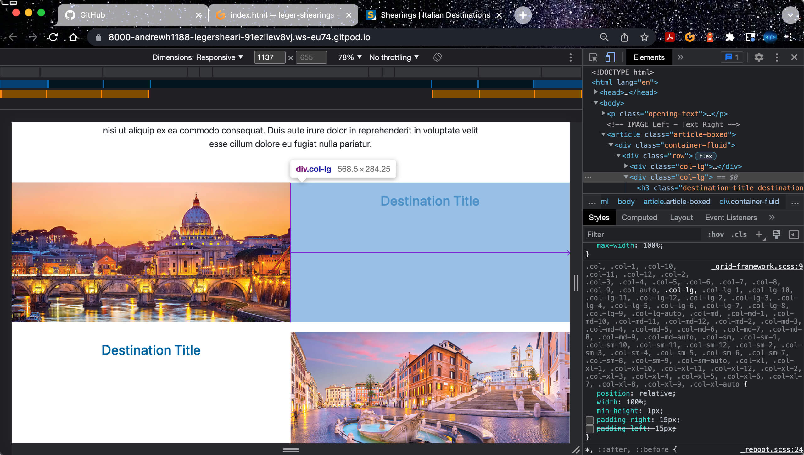
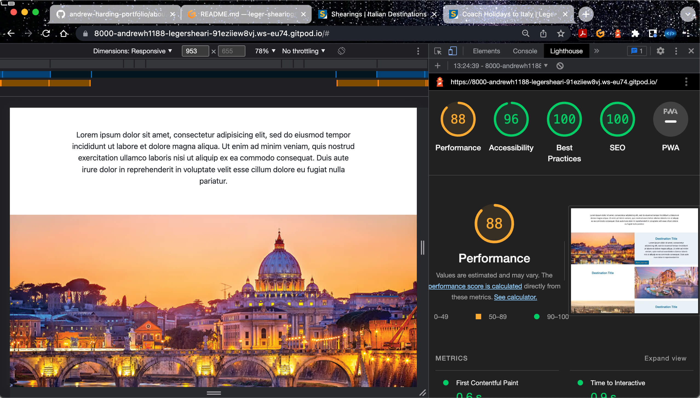
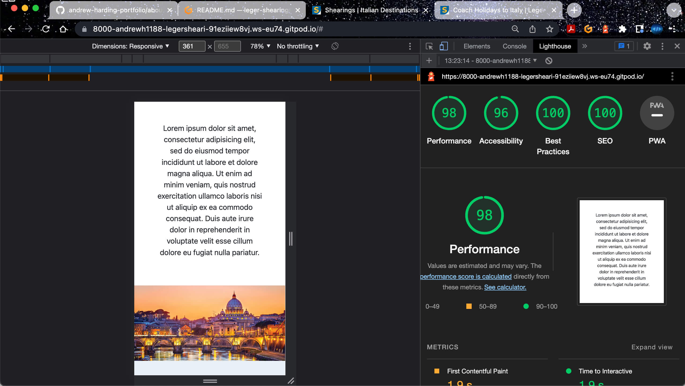

# Leger Shearings Interview Task 3

## Showcase:

A deployed live version of this task can be found [here](https://andrewh1188.github.io/leger-shearings/).
Using this link will allow you to see the published version of this task. If you copy and paste the link into any browser on any device you will also be able to view this task on there too.

## Table of Contents
1. [Idea](#idea)
2. [Images](#Images)
3. [Design](#design)
4. [Sources](#sources)
5. [Testing](#testing)
    * [Google Lighthouse Testing](#google-lighthouse-testing)

## Idea
I looked sourced the layout and design inspiration from the P&O Cruises website on the Mediterranean page. I decided to replicate this kind of layout as I liked the look and feel of it but add in the button feature to book your tour.  

## Images
### Adobe Stock
* [St. Peter's cathedral at night, Rome](https://stock.adobe.com/uk/images/st-peter-s-cathedral-at-night-rome/44298623)

* [Panoramic view of the Roman Forum, Rome, Italy](https://stock.adobe.com/uk/images/panoramic-view-of-the-roman-forum-rome-italy/179316308)

* [Piazza de spagna(Spanish Steps) in rome, italy](https://stock.adobe.com/uk/images/piazza-de-spagna-spanish-steps-in-rome-italy/276263924)

### PixaBay

* [Italy Florence Church](https://pixabay.com/photos/italy-florence-church-tuscany-4256018/)

* [Venice Canal](https://pixabay.com/photos/venice-italy-city-urban-travel-2686292/)

* [St Peter's Basilica Vatican City](https://pixabay.com/photos/rome-st-peter-s-basilica-vatican-5778178/)

## Design

## Sources
* [P&O Cruises](https://www.pocruises.com/cruise-destinations/mediterranean) was used to influence the visual design layout.

* [Tiny PNG](https://tinypng.com/) Used to compress image sizes.

* [Adobe Stock](https://stock.adobe.com/uk/) Used for some images.

* [Pixabay](https://pixabay.com/) Used for some images.

* [Code Institute Gitpod Template](https://github.com/Code-Institute-Org/gitpod-full-template) Adds the Emmet abbreviation to the workspace. 

* [Bootstrap Grid](https://getbootstrap.com/docs/4.0/layout/grid/) To get the layout of images and text to the left and right.

* [Bootstrap Button](https://getbootstrap.com/docs/4.0/components/buttons/) Used to get the button code, but styled using own CSS code.

* [Google Fonts](https://fonts.google.com/specimen/Mulish?query=mulish) After inspecting the Shearings code I could see that they were using the Mulish font from Google Fonts. I headed over to Google fonts to get the links and apply this to the page.

* [Favicon](https://shearings.imgix.net/Content/Shearings/images/favicons/apple-touch-icon.png) I originally made a copy of the Shearings Favicon, but upon inspecting the Shearings website I found there was a link to a better higher quality favicon that they use for their site, so I used the lik for this insetad.

* [Material Design for Bootstrap (MDB) v5 & v4](https://mdbootstrap.com/docs/standard/extended/back-to-top/) HTML, CSS and JavaScript Code used for the back to top button. I have added some CSS for the button so that this is has the same colours as the Shearings brand.

* [Font Awesome](https://fontawesome.com/icons/arrow-up?s=regular&f=classic) Arrow icon used for the back to top button as well as the script tag at the end of the index.html document. This enables the Font Awesome arrow icon to display on the page to the user.

* [St Peter's Basilica Text](https://www.rome.net/st-peters-basilica) Text used from here for the St Peter's Basilica destination section.

* [Spanish Steps Text](https://romesite.com/spanish-steps.html) Text used from here for the Spanish Steps destination section.

* [Florence Text](https://www.visitflorence.com/itineraries-in-florence/three-walking-itineraries.html) Some text used from here for the Florence destination section. Other [Florence Text](https://www.italyguides.it/en/tuscany/florence) was sourced from this page to enhance the content a bit further.

* [Roman Forum Text](https://www.rome.net/roman-forum) Text used from here for the Roman Forum destination section.

* [Venice Canals Text](https://www.goparoo.com/venice/attractions/canals/) Text used from here for the Venice Canals destination section.

* [Vatican City Text](https://www.rome.net/vatican-city) Text used from here for the Vatican City destination section.

## Testing
When viewing my page with the blue destination box and white space (for the images that dont have a box) at first  was showing either side of the image as shown below. 

At first when I inspected the column in Google I thought it could be the image size, but this was not the issue.

Upon further inspecting and tartgeting the blue box in Google I could see that the SCSS with the col-lg padding right and left was set at 15px. Unticking the box meant that the blue box space on the left of the image, and where the image has no box the white space to the right of it were removed. I went into my CSS file and added the .col-lg with the padding-left and padding-right of 0 and this gave me the expected result that I was after.

## Google Lighthouse Testing
Upon my initial testing of my design for Shearings with the images there and the site about half way to completion I was very happy with the results as shown below

### Desktop Testing 1

### Mobile Testing 1

With these results it gives me great confidence that this will provide a positive user experience. This is due to the loading speed of the pages across both mobile and desktop devices able to display very quickly. Also seeing the SEO at 100% for both is also encouraging too. I will take a look at the Accessibility for both to see where I can make improvements and get this to 100%.

### Desktop Testing 2

### Mobile Testing 2
